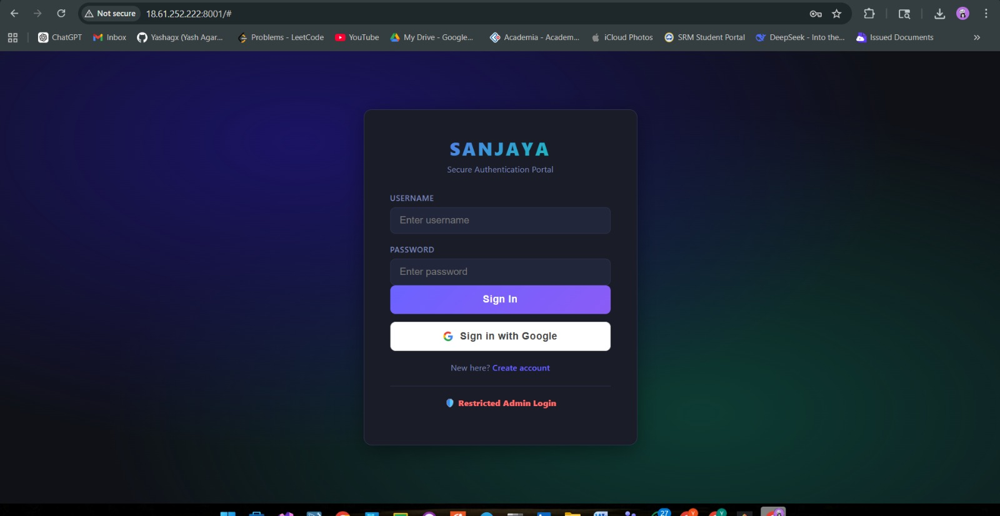
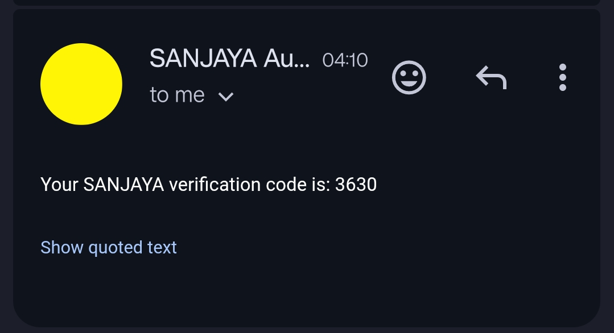
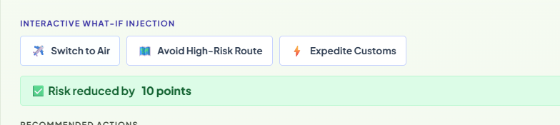
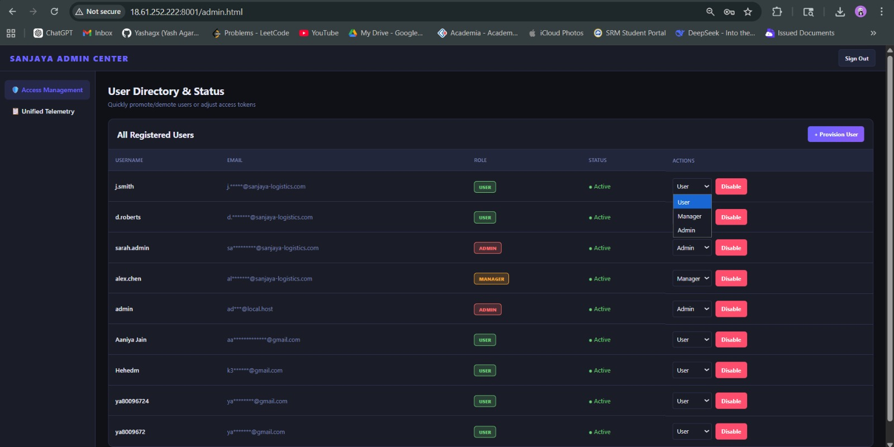
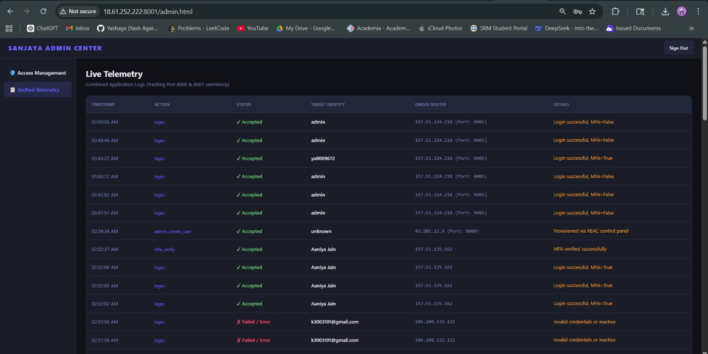
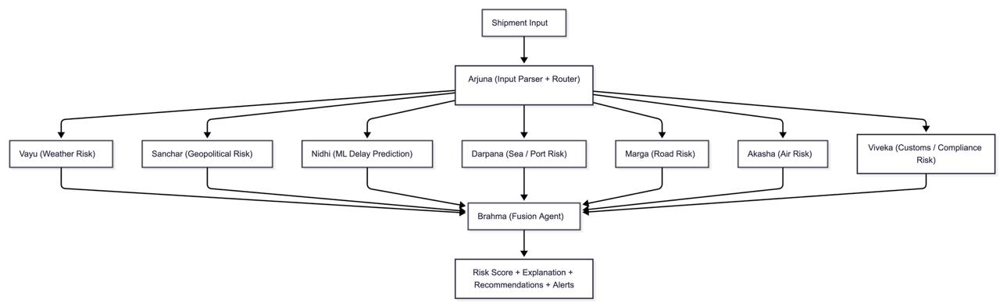

🔱 SANJAYA | Multi-Agent Logistics Risk Intelligence

SANJAYA is a state-of-the-art logistics risk intelligence system that utilizes a resilient multi-agent architecture. Powered by BRAHMA (an AI Logistics Executive) and supporting fallback routing via Amazon Bedrock, it provides real-time shipment delay predictions, geopolitical risk assessments, intelligent routing optimizations, and an interactive "What-If" simulation environment.

🌐 Live Dashboard:
👉 http://16.112.128.251:8000/dashboard#
---

## 📸 System Dashboard & Visual Overview

### 🔐 Multi-Tier Security Gateway
Secure entry point utilizing **Google Identity Services** coupled with a robust **Email-based 4-Digit OTP MFA** for enterprise-grade authentication.

| | |
|---|---|
|  |  |
| *Modern SSO Access & Registration* | *Zero-Trust 4-Digit OTP Deliveries* |

### 🖥️ Main Interactive Dashboard
Experience live tracking, predictive multi-modal assessments, and instant UI diff-renders for scenario planning.


*Central Risk Monitoring and Aggregate AI Statistics.*

### 🔍 Conversational Intelligence & "What-If" Scenario Analysis
Explore hypothetical routing choices directly across the UI and get immediate AI-driven explanations.


*Natural Language Risk Intelligence via BRAHMA & Dynamic Strategy Adjustments.*

### 🤖 Multi-Agent Breakdown
Detailed risk breakdown metrics generated by specialized agents cross-referencing geopolitical data, port congestion, and regional weather.

| | |
|---|---|
|  |  |
| *AI-Powered Anomaly Detection* | *Agent-Specific Drilldown* |

### 👑 Administrative Controls
Complete administrative oversight over the entire deployment matrix.

| | |
|---|---|
|  |  |
| *Real-Time System Tracking* | *User Management Interface* |

### 🧠 Architectural Workflow Design
The core multi-agent lifecycle that governs every incoming shipment assessment.


*Complete Orchestration Lifecycle and Validation Steps.*

---

## 🚀 Key Features

*   **Advanced Authentication**: Fully localized JWT-based user sessions, Google Identity integrations, and OTP email dispatch loops.
*   **Multi-Agent Orchestration**: 7 specialized agents (`NIDHI`, `VAYU`, `SANCHAR`, `DARPANA`, `VIVEKA`, `MARGA`, `AKASHA`).
*   **Unbreakable Intelligence**: BRAHMA AI actively balances primary `gemini-2.5-flash` calls with an offline circuit breaker and an `Amazon Bedrock` failover matrix for guaranteed uptime.
*   **Interactive Simulation Engine**: On-the-fly "What-If" parameter modification rendering live Risk Diff highlights directly inside your dashboard.
*   **Fully Dockerized**: Production-grade microservice orchestration utilizing `docker-compose` combining PostgreSQL, Python 3.12 FastAPI, and zero external dependency setups.

## 🛠️ Tech Stack

*   **Backend**: FastAPI, Python 3.12, Uvicorn
*   **Database**: PostgreSQL (SQLAlchemy ORM)
*   **AI/ML**: Google GenAI, Amazon Bedrock, Scikit-learn
*   **Deployment**: Docker Engine, Docker Compose

## 🏗️ Quick Start Engine

1.  **Environment Variables**: Copy `docker/.env.docker` to `.env` and map your Google Client secrets, SMTP keys, and AWS constraints.
2.  **Container Spin-Up**:
    ```powershell
    docker-compose up -d --build
    ```
3.  **Deploy**: Navigate to `http://localhost:8000/dashboard` and experience the future of logistics planning.

For a detailed deployment overview, refer to the [Docker Setup Guide](docker/README.md).

---

© 2026 SANJAYA Enterprise | Adaptive Route Engineering
